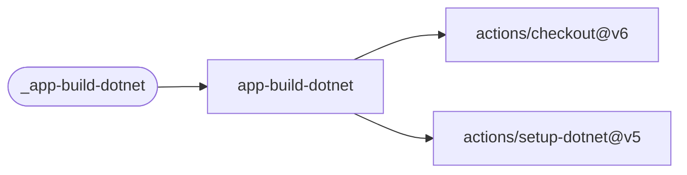
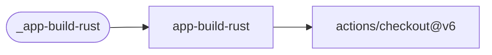
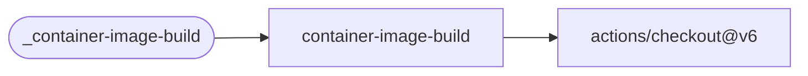
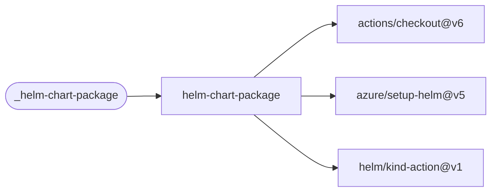
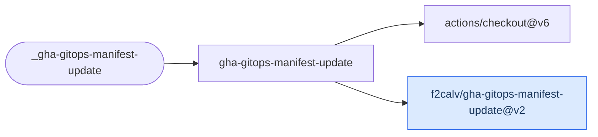
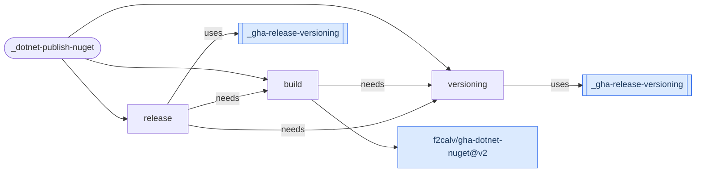

# GitHub Actions Reusable Workflows Repository

A collection of reusable GitHub Actions workflows covering common CI/CD scenarios across public and private repositories. For background on reusable workflows see the [official docs](https://docs.github.com/en/actions/using-workflows/reusing-workflows).

All reusable workflows are called via `workflow_call` and follow a consistent naming convention — the `name:` field is prefixed with `_` (e.g. `_app-build-dotnet`) to distinguish them from standalone workflows.

## Usage

Reference a workflow from any repository:

```yaml
jobs:
  build:
    uses: f2calv/gha-workflows/.github/workflows/app-build-dotnet.yml@v1
    with:
      version: ${{ needs.versioning.outputs.version }}
      solution-name: MySolution.slnx
```

## Workflows

### Application Build

| Workflow | Description | Key Inputs |
| --- | --- | --- |
| [App Build .NET](.github/workflows/app-build-dotnet.yml) | Restore, workload restore, build a .NET solution/project. Installs .NET 8/9/10 SDKs. | `version` (required), `solution-name`, `configuration`, `dotnet-restore-args`, `dotnet-build-args` |
| [App Build Rust](.github/workflows/app-build-rust.yml) | Format check, clippy lint, fetch and build a Rust project. | `version` (required) |

### Containers & Helm

| Workflow | Description | Key Inputs |
| --- | --- | --- |
| [Container Image Build](.github/workflows/container-image-build.yml) | Multi-architecture buildx build and push to a container registry (ghcr.io, ACR, Docker Hub). Tags with semver, major, minor and latest. | `registry` (required), `tag` (required), `tag-major` (required), `tag-minor` (required), `platform`, `push-image` |
| [Helm Chart Package](.github/workflows/helm-chart-package.yml) | Lint, package and push a Helm chart to an OCI registry. Helm version is sourced from `.devcontainer/devcontainer.json`. | `tag` (required), `image-registry` (required), `chart-registry` (required), `chart-repository` (required), `chart-path` |
| [GitOps Manifest Update](.github/workflows/gha-gitops-manifest-update.yml) | Update image tags in a GitOps repository via [f2calv/gha-gitops-manifest-update](https://github.com/f2calv/gha-gitops-manifest-update). | `tag` (required), `image-registry` (required), `image-repository` (required), `manifest-paths` (required), `namespace` (required) |

### NuGet

| Workflow | Description | Key Inputs |
| --- | --- | --- |
| [.NET Publish NuGet](.github/workflows/dotnet-publish-nuget.yml) | Build, test, pack and push NuGet packages via [f2calv/gha-dotnet-nuget](https://github.com/f2calv/gha-dotnet-nuget). | `configuration`, `execute-tests`, `push-preview` |

### Release & Versioning

| Workflow | Description | Key Inputs |
| --- | --- | --- |
| [Release Versioning](.github/workflows/gha-release-versioning.yml) | Determine a semantic version (via [GitVersion](https://gitversion.net/)), tag the repo and create a GitHub release. | `semVer`, `tag-prefix`, `move-major-tag`, `tag-and-release` |

### Code Quality

| Workflow | Description | Key Inputs |
| --- | --- | --- |
| [Lint](.github/workflows/lint.yml) | Run [pre-commit](https://pre-commit.com/) hooks against all files in the repository. | `pre-commit-version` |

## Dependency Diagrams

Mermaid diagrams showing the action dependency chain for each workflow. Actions and workflows owned by [f2calv](https://github.com/f2calv) are highlighted in blue.

### _app-build-dotnet



### _app-build-rust



### _container-image-build



### _helm-chart-package



### _gha-gitops-manifest-update



### _gha-release-versioning


### _dotnet-publish-nuget



### _lint


## Companion Actions

These workflows depend on companion composite actions:

- [f2calv/gha-release-versioning](https://github.com/f2calv/gha-release-versioning) — Semantic versioning with GitVersion
- [f2calv/gha-dotnet-nuget](https://github.com/f2calv/gha-dotnet-nuget) — .NET build, test, pack and NuGet push
- [f2calv/gha-gitops-manifest-update](https://github.com/f2calv/gha-gitops-manifest-update) — GitOps manifest image tag updates

## Other Resources

- [GitHub Actions Docs](https://docs.github.com/en/actions)
- [Reusing Workflows](https://docs.github.com/en/actions/using-workflows/reusing-workflows)
- My older [Azure DevOps Shared YAML Templates](https://github.com/f2calv/CasCap.YAMLTemplates)
