# GitHub Actions Reusable Workflows Repository

A collection of reusable GitHub Actions workflows covering common CI/CD scenarios across public and private repositories. For background on reusable workflows see the [official docs](https://docs.github.com/en/actions/using-workflows/reusing-workflows).

All reusable workflows are called via `workflow_call`. Shared build and validation workflows generally prefix the `name:` field with `_` (for example, `_app-build-dotnet`) to distinguish them from standalone workflows.

## Usage

Reference a workflow from any repository:

```yaml
jobs:
  build:
    uses: f2calv/gha-workflows/.github/workflows/app-build-dotnet.yml@v1
    with:
      version: ${{ needs.versioning.outputs.version }}
      solution-name: MySolution.slnx
```

CI calculates the next semantic version before release and verifies that this
README references the corresponding floating major tag, such as `@v1`. A major
version change therefore cannot release until the usage examples are updated.
Consumers use the floating major tag while immutable patch tags identify each
GitHub release.

## Workflows

### Application Build

| Workflow | Description | Key Inputs |
| --- | --- | --- |
| [App Build .NET](.github/workflows/app-build-dotnet.yml) | Restore, workload restore, build and test a .NET solution/project. Installs .NET 8/9/10 SDKs. Optionally provisions selected Compose services and clones extra repositories into the build context. | `version` (required), `runs-on`, `solution-name`, `configuration`, `execute-tests`, `test-solution-name`, `dotnet-restore-args`, `dotnet-build-args`, `dotnet-test-args`, `test-compose-file`, `test-compose-services`, `extra-repos` |
| [App Build Go](.github/workflows/app-build-go.yml) | Check formatting and modules, run `go vet`, staticcheck, build and test a Go module. The toolchain version comes from `go.mod`. | `version` (required), `runs-on`, `go-version-file`, `package`, `ldflags` |
| [App Build Python](.github/workflows/app-build-python.yml) | Validate the uv lockfile, restore all dependency groups, run Ruff, mypy and pytest, then build the Python package. | `version` (required), `runs-on` |
| [App Build Rust](.github/workflows/app-build-rust.yml) | Check formatting, run Clippy, fetch dependencies and build a Rust project. | `version` (required), `runs-on` |

`dotnet-test-args` is a JSON array so each argument remains distinct, including values containing
spaces. For example: `["--filter", "FullyQualifiedName~Tests With Spaces"]`.

Tests target `solution-name` by default. Set `test-solution-name` only when a different solution or
project must be tested independently.

`test-compose-services` is a JSON array of services to start before testing and stop afterward. Set
`test-compose-file` only when the repository does not use the default Compose filename.

### Mobile Deployment

| Workflow | Description | Key Inputs |
| --- | --- | --- |
| [Deploy MAUI Android](.github/workflows/_deploy-maui-android.yml) | Build an unsigned Android App Bundle, or sign and upload it to Google Play when deployment is enabled. Deployment requires the documented Android signing and Google Play secrets. | `runs-on`, `deploy`, `dotnet-version`, `configuration`, `package-name`, `play-track`, `app-display-version`, `app-version-code` |

### Database

| Workflow | Description | Key Inputs |
| --- | --- | --- |
| [EF Migrations Drift](.github/workflows/ef-migrations-drift.yml) | Fail when the EF Core model has schema changes not captured by a migration (runs `dotnet ef migrations has-pending-model-changes`; no live database required). Installs .NET 8/9/10 SDKs and restores tools. The caller repo must pin `dotnet-ef` in `.config/dotnet-tools.json` and provide an `IDesignTimeDbContextFactory` configured with the migrations provider. | `project` (required), `runs-on`, `startup-project`, `context`, `configuration`, `extra-repos` |

### Infrastructure

| Workflow | Description | Key Inputs |
| --- | --- | --- |
| [Terraform](.github/workflows/terraform.yml) | Run Terraform formatting and validation without cloud credentials, or run the stateful `plan`, `apply`, and `destroy` lifecycle with Azure authentication. Validation uses backend-free initialization and can verify an expected immutable module tag in the README. A `plan` run uploads the plan so a later `apply` can consume the exact artifact. | `working-directory` (required), `runs-on`, `command`, `terraform-version`, `environment`, `environment-files`, `backend-config`, `backend-config-file`, `azure-backend-key`, `var-file`, `azure-login`, `use-oidc`, `artifact-name`, `log-level`, `deployment-version`, `deployment-commit`, `deployment-layer`, `lock-id`, `state-rm`, `expected-release-tag`, `readme-path` |

### Containers & Helm

| Workflow | Description | Key Inputs |
| --- | --- | --- |
| [Container Image Build](.github/workflows/container-image-build.yml) | Multi-architecture buildx build and push to a container registry (ghcr.io, ACR, Docker Hub). Tags with the exact semver plus latest (or latest-dev off the default branch); published versions are immutable and are never overwritten. Optionally runs a smoke test and clones extra repositories into the build context. | `registry` (required), `tag` (required), `runs-on`, `repository`, `repository-prefix`, `dockerfile`, `default-branch-tag`, `feature-branch-tag`, `platform`, `args`, `default-branch`, `push-image`, `attestations`, `github-private-packages-auth`, `extra-repos`, `smoke-test`, `smoke-test-platform` |
| [Helm Chart Package](.github/workflows/helm-chart-package.yml) | Lint, package and push a Helm chart to an OCI registry. The Helm version comes from `.devcontainer/devcontainer.json`; chart testing can use lint or KIND-backed install mode. | `tag` (required), `image-registry` (required), `image-repository` (required), `chart-registry` (required), `chart-repository` (required), `runs-on`, `tag-override`, `chart-path`, `is-library-chart`, `set-chart-app-version`, `has-image`, `push-chart`, chart testing and registry credentials |
| [GitOps Helm Update](.github/workflows/gitops-helm-update.yml) | Update image and chart coordinates in ArgoCD Helm manifests, then optionally commit them to a GitOps repository. Requires `GH_PAT_GITOPS`. | `manifest-paths` (required), `tag` (required), `namespace` (required), `image-registry` (required), `image-repository` (required), `gitops-repo` (required), `runs-on`, `tag-override`, chart coordinates, Git controls, `devcontainer-path`, `environment` |
| [GitOps Manifest Update](.github/workflows/gha-gitops-manifest-update.yml) | Update image and optional chart coordinates in Kubernetes manifests via [f2calv/gha-gitops-manifest-update](https://github.com/f2calv/gha-gitops-manifest-update), then optionally commit them. | `tag` (required), `image-registry` (required), `image-repository` (required), `manifest-paths` (required), `namespace` (required), `runs-on`, `tag-override`, chart coordinates, `devcontainer-path`, Git repository and commit controls |
| [Package Cleanup](.github/workflows/package-cleanup.yml) | Prune old container and Helm chart versions from ghcr.io via [dataaxiom/ghcr-cleanup-action](https://github.com/dataaxiom/ghcr-cleanup-action). Keeps the N most-recent tagged versions, deletes untagged orphans, and protects excluded tags. Defaults to dry-run. | `packages` (required), `runs-on`, `keep-n-tagged`, `exclude-tags`, `older-than`, `delete-untagged`, `dry-run` |

### Release & Versioning

| Workflow | Description | Key Inputs |
| --- | --- | --- |
| [Release Versioning](.github/workflows/gha-release-versioning.yml) | Determine a semantic version via GitVersion, tag the repository and create a GitHub release. | `runs-on`, `semVer`, `tag-prefix`, `move-major-tag`, `tag-and-release`, `gv-config`, `gv-source` |

### Code Quality

| Workflow | Description | Key Inputs |
| --- | --- | --- |
| [Lint](.github/workflows/lint.yml) | Run [pre-commit](https://pre-commit.com/) hooks against all files in the repository. | `runs-on`, `pre-commit-version` |

### Diagnostics

| Workflow | Description | Key Inputs |
| --- | --- | --- |
| [Input Expression Test](.github/workflows/test.yml) | Internal diagnostic workflow demonstrating boolean behavior across `workflow_dispatch` and `workflow_call`; not a production validation workflow. | `runs-on`, `test-true`, `test-false` |

## Deployment Flow

Mermaid diagrams showing the action dependency chain for each workflow. Actions and workflows owned by [f2calv](https://github.com/f2calv) are highlighted in blue.

### _app-build-dotnet

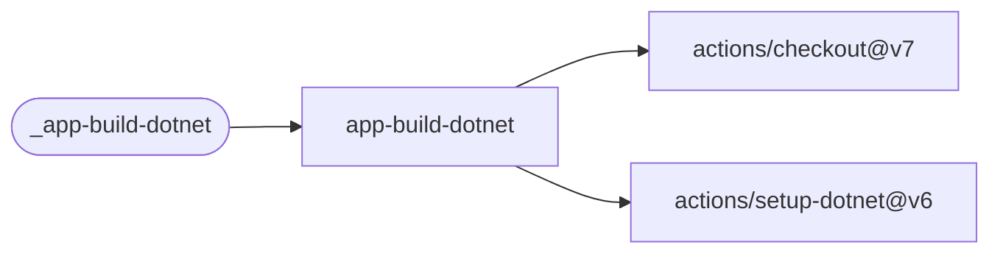

### _app-build-go

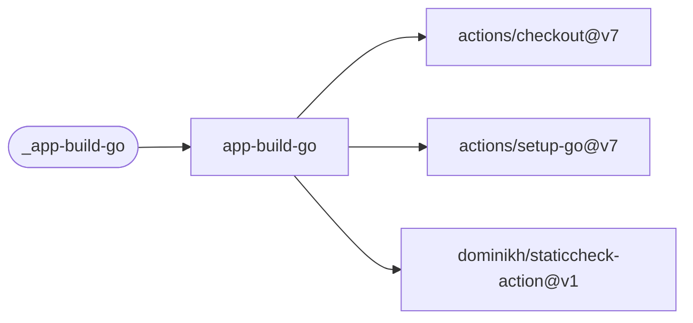

### _app-build-python

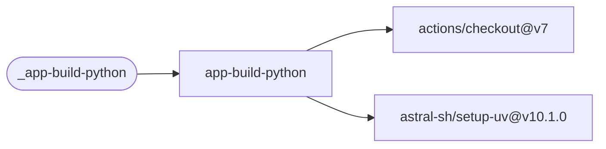

### _app-build-rust

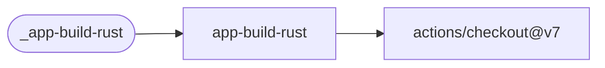

### deploy-maui-android

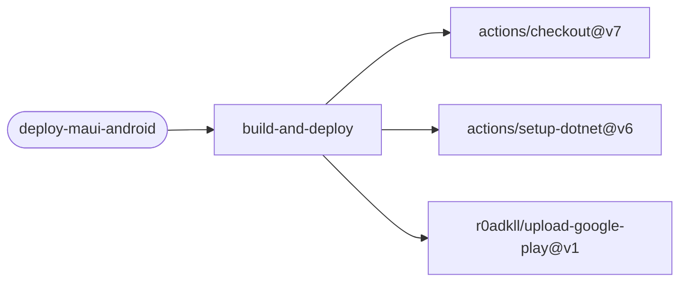

### _ef-migrations-drift

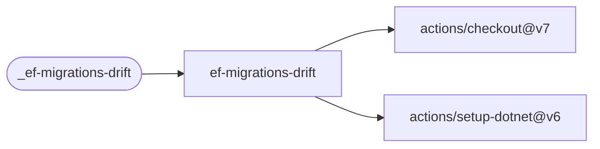

### _terraform

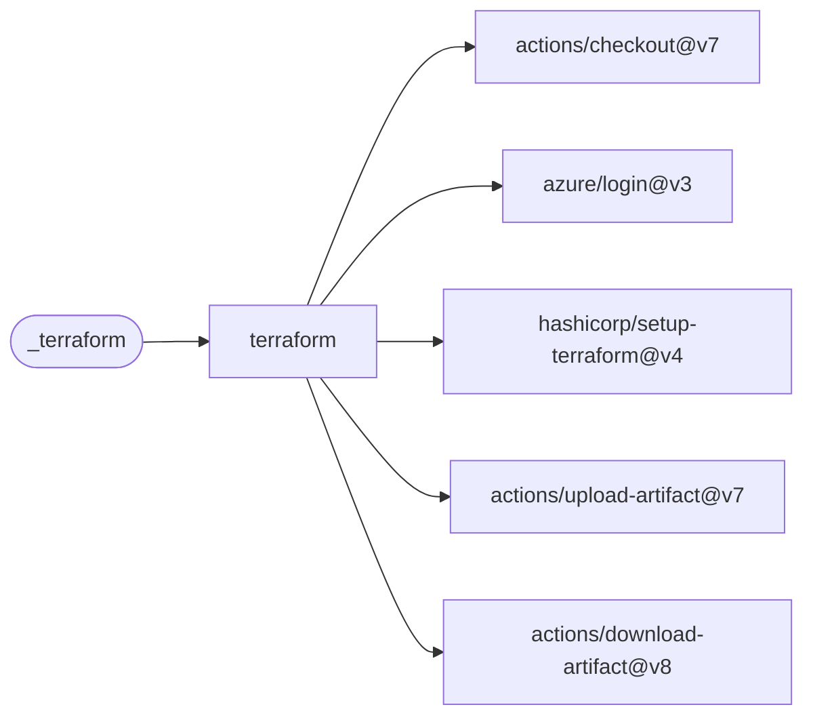

### _container-image-build

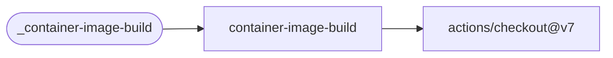

### _helm-chart-package

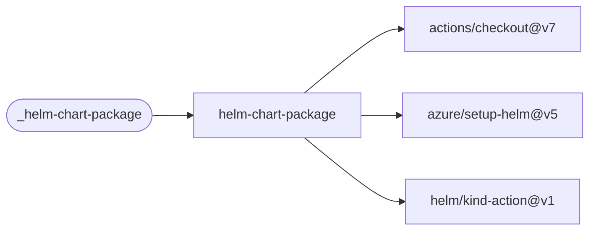

### _gitops-helm-update

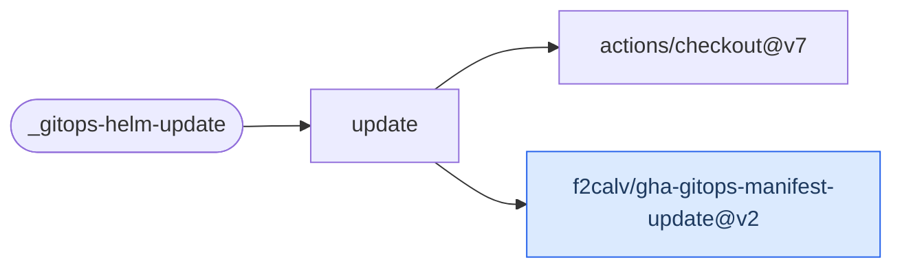

### _gha-gitops-manifest-update


### _package-cleanup

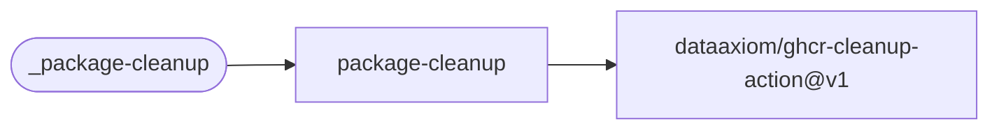

### _gha-release-versioning

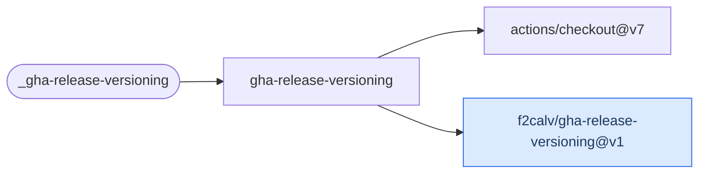

### _lint

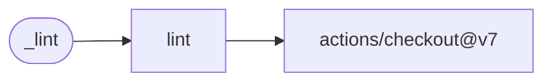

### _test

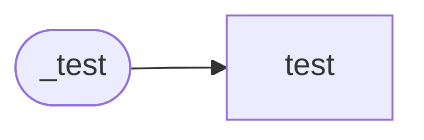

## Companion Actions

These workflows depend on companion composite actions:

- [f2calv/gha-release-versioning](https://github.com/f2calv/gha-release-versioning) — Semantic versioning with GitVersion
- [f2calv/gha-dotnet-nuget](https://github.com/f2calv/gha-dotnet-nuget) — .NET build, test, pack and NuGet push
- [f2calv/gha-gitops-manifest-update](https://github.com/f2calv/gha-gitops-manifest-update) — GitOps manifest image tag updates

## Other Resources

- [GitHub Actions Docs](https://docs.github.com/en/actions)
- [Reusing Workflows](https://docs.github.com/en/actions/using-workflows/reusing-workflows)
- My older [Azure DevOps Shared YAML Templates](https://github.com/f2calv/CasCap.YAMLTemplates)
